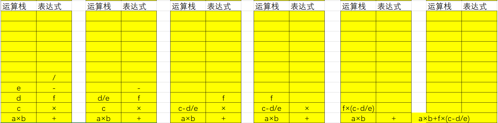
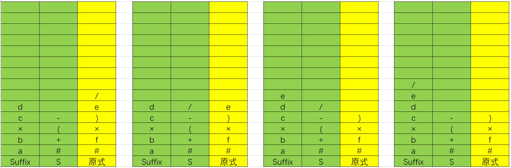
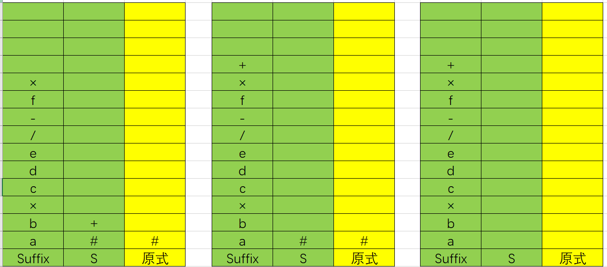
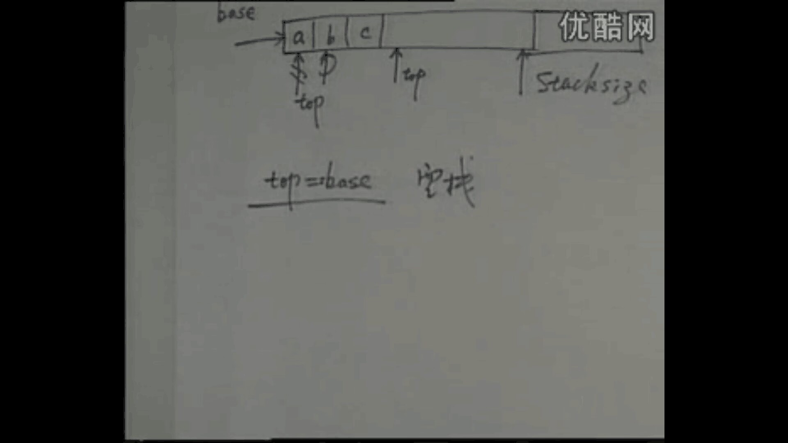

从数据结构的角度来看, 栈和队列也是线性表, 但从类型来看, 它们是不同的, 即操作不一样. 

# 3.1 栈的类型定义

**栈**是限定仅在表尾进行插入或删除操作的线性表. 因此, 对于栈来说, 表尾端有其特殊含义, 称为`栈顶(top)`, 相应地, 表头端称为`栈底(bottom)`. 不含元素的空表称为空栈. 

| 操作名称 | 线性表                                                       | 栈                | 队列              |
| -------- | ------------------------------------------------------------ | ----------------- | ----------------- |
| 插入     | ListInsert(L, i, e), $1\leqslant i\leqslant ListLength(L)+1$; | Insert(S, n+1, e) | Insert(Q, n+1, e) |
| 删除     | ListDelete(L, i, &e), $1\leqslant i\leqslant ListLength(L)$; | Delete(S, n, &e)  | Delete(Q, 1, &e)  |

抽象数据类型栈的定义: 

> ADT Stack{
>
> ​	数据对象: $D = \{a_i|a_i\in ElemSet, i=1, 2, \cdots, n, n\geqslant0\}$; 
>
> ​	数据关系: $R1 = \{<a_{i-1}, a_i>|a_{i-1}, a_i\in D, i=2, \cdots, n\}$, 约定$a_n$端为栈顶, $a_1$端为栈底; 
>
> ​	基本操作: 
>
> ​		InitStack(&S)
>
> ​			操作结果: 构造一个空栈S. 
>
> ​		DestroyStack(&S)
>
> ​			初试条件: 栈S已存在. 
>
> ​			操作结果: 栈S被销毁. 
>
> ​		StackEmpty(S)
>
> ​			初试条件: 栈S已存在. 
>
> ​			操作结果: 若栈S为空栈, 则返回TRUE; 否则返回FALSE. 
>
> ​		StackLength(S)
>
> ​			初试条件: 栈S已存在. 
>
> ​			操作结果: 返回S的元素个数, 即栈的长度. 
>
> ​		GetTop(S, &e)
>
> ​			初试条件: 栈S已存在且非空. 
>
> ​			操作结果: 用e返回S的栈顶元素. 
>
> ​		ClearStack(&S)
>
> ​			初试条件: 栈S已存在. 
>
> ​			操作结果: 将S清为空栈. 
>
> ​		Push(&S, e)
>
> ​			初试条件: 栈S已存在. 
>
> ​			操作结果: 插入元素e为新的栈顶元素. 
>
> ​		Pop(&S, &e)
>
> ​			初试条件: 栈S已存在且非空. 
>
> ​			操作结果: 删除S的栈顶元素, 并用e返回其值. 
>
> ​		StackTraverse(S, visit())
>
> ​			初试条件: 栈S已存在且非空. 
>
> ​			操作结果: 从栈顶到栈底依次对S的每个数据元素调用函数visit(). 一旦visit()失败, 则操作失效. 
>
> }ADT Stack

# 3.2 栈的应用举例

​	在实际应用中, 栈的应用非常广泛. 如果某一个问题经过分析发现求解的过程中有后进先出的特点, 那么就可以考虑使用栈结构来解决这个问题. 以下举出六个例子. 

## 3.2.1 数制转换

算法基于下列原理: 
$$
N = (N/d)\times d + N\ mod\ d.
$$
例如: $(1348)_{10} = (2504)_8$, 其运算过程如下: 

| $N$  | $N/8$ | $N\ mod\ 8$ |
| ---- | ----- | ----------- |
| 1348 | 168   | 4           |
| 168  | 21    | 0           |
| 21   | 2     | 5           |
| 2    | 0     | 2           |

上述计算过程是从上到下的, 但是输出结果确实从下往上打印输出. 因此使用栈实现上述操作较为合理. 

``` c
void conversion() {
    // 对于输入的任意一个非负十进制数, 打印输出与其等值的八进制数
    InitStack(S); // 构造空栈
    scanf("%d", N):
    while (N){
        Push(S, N%8);
        N = N/8;
    }
    while (!StackEmpty(S)) {
        Pop(S, e);
        printf("%d", e);
    }
} // conversion
```

栈的引入简化了程序设计的问题, 划分了不同的关注层次, 使思考范围缩小. 若使用数组不仅掩盖了问题的本质, 还要分散精力去考虑数组下标增减等细节问题, 程序可读性较差. 

## 3.2.2 括号匹配检测

​	检验括号是否匹配的方法用`期待的急迫程度`这个概念来描述, 且期待程度随着另外一个括弧的出现而减弱. 在设计算法时, 要弄清楚什么情况为错误情况, 主要归纳为如下三种: [(])、(()])、([()). 反应到栈中则是如下几种情况: 

- 到来的右括弧`不是所"期待"`的;
- 到来的是`"不速之客"`;
- 直到结束, 也`没有到来所"期待"`的. 

综上, 算法的设计思想如下: 

1. 凡出现左括弧, 则进栈;
2. 凡出现右括弧, 首先检查栈是否空. 若栈空, 则表明"右括弧"多了; 否则和栈顶元素比较, 若匹配, 则"左括弧出栈", 否则不匹配;
3. 表达式检验结束时, 若栈空, 则匹配正确, 否则表明左括弧多了. 

``` c
Status matching(string &exp) {
    int state = 1;
    InitStack(S);
    while (i<=Length(exp) && state) {
        switch of exp[i] {
            case 左括弧:{Push(S, exp[i]); i++; break;}
            case ")":{
                if (NOT StackEmpty(S) && GetTop(S)="(") {Pop(S, e); i++;}
                else state = 0;
                break;
            }
                ... ...
        }
    }
    if (StackEmpty(S) && state) return OK;
    else return ERROR;
}
```


## 3.2.3 行编辑程序问题

​	一个简单的行编辑程序的功能是: 接受用户从终端输入的程序或数据, 并存入用户的数据区. 较好的做法是, 设立一个缓冲区, 用以接收用户输入的一行字符, 然后逐行存入用户数据区. 允许用户输入出差错, 并在发现有误时可以即使更正. 设立退格符"#"、退行符"@". 

``` c
void LineEdit() {
    // 利用字符栈S, 从终端接收一行并传送至调用过程的数据区
    InitStack(S);	// 构造空栈S
    ch = getchar();	// 从终端接收第一个字符
    while(ch != EOF) { // EOF为全文结束符
        while (ch != EOF && ch != '\n') {
            switch(ch) {
                case '#':Pop(S, c); break; // 仅当栈非空时退栈
                case '@':ClearStack(S);	break; // 重置S为空栈
                default:Push(S, ch);	break; // 有效字符进栈, 未考虑栈满情形
            }
            ch = getchar(); // 从终端接收下一个字符
        }
        将从栈底到栈顶的栈内字符传送至调用过程的数据区;
        ClearStack(S); // 重置S为空栈
        if(ch != EOF) ch = getchar();
    }
    DestroyStack(S);
} // LineEdit
```

## 3.2.4 迷宫求解

求迷宫路径算法的基本思想是: 

- 若当前位置"可通", 则纳入路径, 继续前进;
- 若当前位置"不可通", 则后退, 换向探索;
- 若四周均"不可通", 则从路径中删除. 

算法可简单用文字描述如下:

> **do** {
>
> ​	**若**当前位置可通, 
>
> ​	**则** {
>
> ​		将当前位置插入栈顶;	// 纳入路径
>
> ​		若该位置是出口位置, 则结束;	// 求得路径存放在栈中
>
> ​		否则切换当前位置的东邻方块为新的当前位置; 
>
> ​	}
>
> ​	**否则**, 
>
> ​		**若**栈不空且栈顶位置尚有其他方向为经探索, 
>
> ​			**则**设定新的当前位置为沿顺时针方向旋转找到的栈顶位置的下一相邻快;
>
> ​		**若**栈不空但栈顶位置的四周均不可通, 
>
> ​			**则** {
>
> ​				删去栈顶位置; 	// 从路径中删除该通道块
>
> ​				**若**栈不空, 则重新测试新的栈顶位置, 直至找到一个可通的相邻块或出栈至栈空; 
>
> ​			}
>
> } **while**(栈不空);

## 3.2.5 表达式求值

限于二元运算的表达式定义: 

> **表达式**: (操作数)+(运算符)+(操作数)
>
> **操作数**: 简单变量 | 表达式
>
> **运算符**: 标识符 | 无符号整数

​	在计算机中, 表达式可以有三种不同的表示方法: 设`Exp = S1 + OP + S2`, 则称

1. `OP` + S1 + S2为表达式的**前缀表示法**;
2. S1 + `OP` + S2为表达式的**中缀表示法**;
3. S1 + S2 + `OP`为表达式的**后缀表示法**. 

可见, 它是以运算符所在不同位置命名的. 

例如: $Exp = \underline{a\times b} + \underline{(c-d/e)\times f}$. 

前缀式: $Exp = +\underline{\times ab}\underline{\times-c/def}$; 中缀式: $Exp = \underline{a\times b} + \underline{c-d/e\times f}$; 后缀式: $Exp = \underline{ab\times}\underline{cde/-f\times }+$. 

通过比较上述三种表示法得出结论: 

1. 操作数之间的相对次序不变; 
2. 运算符的相对次序不同; 
3. 中缀式丢失了括弧信息, 致使运算的次序不确定; 
4. 前缀式的运算规则为: 连续出现的两个操作数和在他们之前且紧靠他们的运算符构成一个最小表达式; 
5. 后缀式的运算规则为: 运算符在式中出现的顺序恰为表达式的运算顺序, 每个运算符和在它之前出现且靠近它的两个操作数构成一个最小表达式. 

​	基于以上结论, 计算机在表达式求值时要将表达式用后缀表示法表示. 从后缀表达式中求值的方法概括来说为: `先找运算符, 在找操作数`. 




​	下面讨论如何从原表达式求出后缀表达式. 分析原表达式和后缀表达式中的运算符发现, 每个运算符的运算次序要由它之后的一个运算符来定, 在后缀式中, 优先数高的运算符领先于优先数低的运算符. 

从原表达式求得后缀表达式的算法为: 

> 1. 设立`运算符栈S`;
> 2. 设表达式的结束符为"#", 预设运算符栈的栈底为"#";
> 3. 若当前字符时操作数, 则直接发送给`后缀式Suffix`;
> 4. 若`栈顶运算符`的优先级小于`当前运算符`, 则`进栈`;
> 5. 否则, 退出栈顶运算符, 发送给后缀式;
> 6. "("对它前后的运算符起隔离作用, ")"可视为自相应左括弧开始的表达式; 
> 7. 当左右括弧相遇时, 括号内的运算已经完成; 同理, 当两个"#"相遇时, 表示整个表达式求值完毕. 







```c
void transform(char Suffix[], char exp[]) {
    InitStack(S); Push(S, '#');
    p = exp; ch = *p;
    while(!StackEmpty(S)) {
        if(!IN(ch, OP)) Pass(Suffix, ch);
        else {
            switch(ch) {
                case '(': Push(S, ch); break;
                case ')': {
                    Pop(S, c);
                    while(c!='(')
                    {Pass(Suffix, c); Pop(S, c);}
                    break;
                }
                default: {
                    while(Gettop(S, c) && precede(c, ch)) // 老师的代码这里Gettop函数前加了!, 但似乎不加!才是对的
                    {Pass(Suffix, c); Pop(S, c);}
                    if(ch != '#') Push(S, ch);
                    break;
                }
            } // switch
        } // else
        if(ch != '#') 
        {p++; ch = *p;}
    } //  while
}
```

其中使用`Pass(Suffix, c)`函数将字符c发送给后缀式, 使用`precede(c, ch)`函数比较两个字符的优先级, 若c的优先级大于ch则返回TRUE. 

## 3.2.6 实现递归

当在一个函数的运行期间调用另一个函数时, 在运行该被调用函数之前, 需先完成三件事: 

1. 将所有的实在参数、返回地址等信息传递给被调用函数保存; 
2. 为被调用函数的局部变量分配存储区; 
3. 将控制转移到被调用函数的入口. 

从被调用函数返回调用函数之前, 应该完成: 

1. 保存被调用函数的计算结果; 
2. 释放被调用函数的数据区; 
3. 依照被调用函数保存的返回地址将控制转移到调用函数. 

多个函数调用嵌套的规则是`后调用先返回`, 此时的内存管理实行**"栈式管理"**. 

> 一个直接调用自己或通过一系列的调用语句间接地调用自己的函数, 称做**递归函数**; 
>
> 递归过程指向过程中占用的数据区, 称之为**递归工作栈**; 
>
> 每一层的递归参数合成一个记录, 称之为**递归工作记录**; 
>
> 栈顶记录指示当前层的执行情况, 称之为**活动当前记录**; 
>
> 栈顶指针, 称之为**当前环境指针**. 

``` c
void hanoi(int n, char x, char y, char z) {
    // 将塔座x上按直径由小到大且至上而下编号为1至n的n个圆盘按规则搬到塔座z上, y可用作辅助塔座. 
    if(n==1) move(x, 1, z); // 讲编号为1的圆盘从x移到z
    else {
        hanoi(n-1, x, z, y); // 将x上编号为1至n-1的圆盘移到y, z作辅助塔
        move(x, n, z); // 讲编号为n的圆盘从x移到z
        hanoi(n-1, y, x, z); // 将y上编号为1至n-1的圆盘移到z, x作辅助塔
    }
}
```

# 3.3 栈类型的实现

栈类型的实现有两种方法, 一种是**顺序栈**, 一种是**链栈**. 

顺序栈类似于线性表的顺序映象实现, 指向表尾的指针可以作为栈顶指针. 

``` c
// -----------------------------栈的顺序存储表示-----------------------------

# define STACK_INIT_SIZE	100
# define STACKINCREMENT		10

typedef struct {
    SElemType	*base;
    SElemType	*top;
    int			stacksize;
}SqStack;
```

初始化顺序栈时, 栈底指针和栈顶指针指向同一个位置, `top=base`, 此时为空栈. 每插入一个元素, 栈顶指针发生移动, 指向最后一个元素的下一个位置, 当预分配的空间填满时, 可新增分配空间. 



链栈的实现和链表类似, 需要注意的是链栈的指针指示方向和链表相反. 

# 3.4 队列的类型定义

> ADT Queue {
>
> ​	数据对象: $D=\{a_i|a_i\in ElemSet, i=1,2,\cdots,n, n\geqslant0\}$;
>
> ​	数据关系: $R = \{<a_{i-1}, a_i>|a_{i-1}, a_i\in D, i=2,3,\cdots,n\}$;
>
> ​		约定其中$a_1$端为队列头, $a_n$端为队列尾.
>
> ​	基本操作: 
>
> ​		InitQueue(&Q);
>
> ​		DestroyQueue(&Q);
>
> ​		QueueEmpty(Q);
>
> ​		QueueLength(Q);
>
> ​		GetHead(Q, &e);
>
> ​			初始条件: Q为非空队列
>
> ​			操作结果: 用e返回Q的队头元素
>
> ​		ClearQueue(&Q);
>
> ​		EnQueue(&Q, e);
>
> ​			初始条件: 队列Q已存在
>
> ​			操作结果: 插入元素e为Q的新的队尾元素
>
> ​		DeQueue(&Q, &e);
>
> ​			初始条件: Q为非空队列
>
> ​			操作结果: 删除Q的队头元素, 并用e返回其值
>
> }ADT Queue 

# 3.5 队列类型的实现

## 3.5.1 链队列--链式映象

``` c
typedef struct QNode {
    QElemType		data;
    struct QNode	*next;
}QNode, *QueuePtr;

typedef struct {
	QueuePtr	front; // 队头指针
    QueuePtr	rear; // 队尾指针
}LinkQueue;
```

与线性表类似, 队列也是一种线性结构, 链队列同样也需要一个头指针. 在初始化链队列时, 创建一个头结点, 它的指针域为空, 队头指针和队尾指针都指向这个头结点, 此时表示创建了一个空队列. 因此, 队尾指针指向的元素就是队列尾, 队头指针指向的结点的下一个结点才是队列头. 

执行`EnQueue()`时, 类似于向链表的表尾插入一个元素, 但是不同的是需要移动队尾指针指向最新的队尾元素. 

执行`DeQueue()`时, 要删除头结点指向的结点, 即首元结点, 不需要移动队头指针和队尾指针, 并用e返回删除元素的值. 但是存在特例, 即当链队列中只有一个元素时, 将此元素按照上述方法出队列后, 队尾指针丢失了, 因此这种情况下需对队尾指针重新赋值. 

## 3.5.2 循环队列--顺序映象

``` c
# define MAXQSIZE	100 // 最大队列长度

typedef struct {
	QElemType	*base; // 动态分配存储空间
    int			front; // 头指针, 若队列不空则指向队列头元素
    int			rear; // 尾指针, 若队列不空, 指向队列尾元素的下一个位置
}SqQueue;
```

初始化循环队列时, 分配`MAXQSIZE`大小的空间, 头指针和尾指针指向同一个位置. 每当有元素入队列时, 移动尾指针; 当有元素出队列时, 移动头指针. 


若如此操作, 则随着入队列和出队列操作的进行, 队列前的很大一块空间将无法利用而造成浪费, 因此将循环队列的尾部和头部相连, 构造循环结构, 这也是循环队列无法像线性表一样新增空间的原因, 循环队列一旦建立, 它所分配空间的大小就无法改变. 

这样带来的一个问题是`Q.front=Q.rear`的含义无法确定, 即无法判定队列是否为空. 这是因为当循环队列为空时, 该语句成立; 但是因为循环队列的特性, 当循环队列满时, 该语句也成立. 为解决这个问题, 循环队列将浪费一个空间来判定队列是否填满. 如下图所示, 当`Q.front=Q.rear`成立时, 表示循环队列空; 当`(Q.rear+1)%MAXQSIZE=Q.front`时, 表示循环队列满. 


# 本章小结

1. 掌握栈(后进先出)和队列(先进先出)类型的特点, 并能在相应的应用问题中正确选用它们; 
2. 熟练掌握栈类型的两种实现方法, 特别应注意栈满和栈空的条件以及它们的描述方法; 
3. 熟练掌握循环队列和链队列的基本操作实现算法, 特别注意队满和队空的描述方法; 
4. 理解递归算法执行过程中栈的状态变化过程. 

