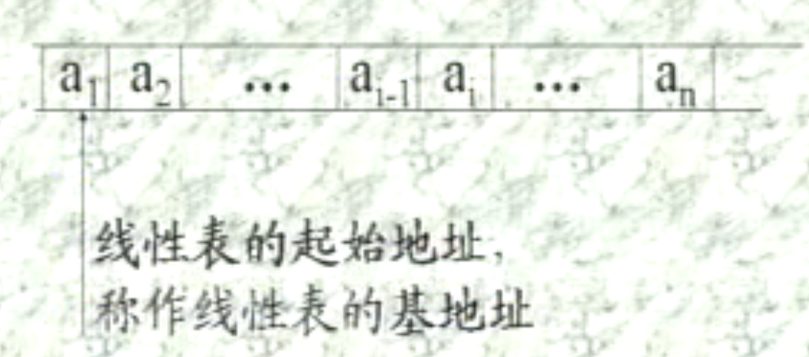

**线性结构**是一个数据元素的*有序(次序)集*.

线性结构的基本特征:

1. 集合中必存在唯一的一个<mark>"第一元素"</mark>;

2. 集合中必存在唯一的一个<mark>"最后元素"</mark>;

3. 除了最后元素外, 均有<mark>唯一的后继</mark>;

4. 除了第一元素外, 均有<mark>唯一的前驱</mark>.

# 2.1 线性表的类型定义

> ADT List{
> 
>     数据对象: $D = \{a_i | a_i\in ElemSet, i=1, 2, \cdots, n, n\geqslant0\}$.
> 
>                                 {称n为线性表的**表长**, n为0时的线性表为**空表**. }
> 
>     数据关系: $R1 = \{<a_{i-1}, a_i> | a_{i-1}, a_i \in D, i=2, \cdots, n\}$.
> 
>                              {设线性表为$(a_1,a_2, \cdots, a_i, \cdots, a_n)$, 称i为$a_i$在线性表中的**位序**}
> 
>     基本操作: 
> 
>         **结构初始化**:
> 
>         InitList(&L)
> 
>             操作结果: 构造一个空的线性表.
> 
>         **销毁结构**:
> 
>         DestroyList(&L)
> 
>             初始条件: 线性表L已存在.
> 
>             操作结果: 销毁线性表L. 
> 
>         **引用型操作**(指操作的结果不改变结构):
> 
>         ListEmpty(L)
> 
>             初始条件: 线性表L已存在. 
> 
>             操作结果: 若L为空表, 则返回TRUE, 否则返回FALSE. 
> 
>         ListLength(L)
> 
>             初始条件: 线性表L已存在. 
> 
>             操作结果: 返回L中数据元素的个数. 
> 
>         PriorElem(L, cur_e, &pre_e)
> 
>             初始条件: 线性表L已存在. 
> 
>             操作结果: 若cur_e是L中的元素, 且不是第一个, 则用pre_e返回它的前驱, 否则操作失败, pre_e无定义. 
> 
>         NextElem(L, cur_e, &next_e)
> 
>             初始条件: 线性表L已存在.
> 
>             操作结果: 若cur_e是L中的元素, 且不是最后一个, 则用next_e返回它的后继, 否则操作失败, next_e无定义.
> 
>         GetElem(L, i, &e)
> 
>             初始条件: 线性表L已存在, $1\leqslant i\leqslant ListLength(L)$.
> 
>             操作结果: 用e返回L中第i个数据元素的值. 
> 
>         LocateElem(L, e, compare())
> 
>             初始条件:线性表L已存在, compare()是数据元素判定函数. 
> 
>             操作结果: 返回L中第1个与e满足关系compare()的数据元素的位序. 若这样的数据元素不存在, 则返回值为0. 
> 
>         ListTraverse(L, visit())
> 
>             初始条件: 线性表L已存在. 
> 
>             操作结果: 依次对L中每个数据元素调用函数visit(). 一旦visit()失败, 则操作失败. 
> 
>         **加工型操作**(操作结果改变了结构):
> 
>         ClearList(&L)
> 
>             初始条件: 线性表L已存在. 
> 
>             操作结果: 将L重置为空表. 
> 
>         PutElem(L, i, &e)
> 
>             初始条件: 线性表L已存在, $1\leqslant i\leqslant ListLength(L)$.
> 
>             操作结果: L中第i个元素赋值同e的值. 
> 
>         ListInsert(&L, i, e)
> 
>             初始条件: 线性表L已存在, $1\leqslant i\leqslant ListLength(L) + 1$.
> 
>             操作结果: 在L中第i个位置(新元素的位置即为i)之前插入新的数据元素e, L的长度加1. 
> 
>         ListDelete(&L, i, &e)
> 
>             初始条件: 线性表L已存在, $1\leqslant i\leqslant ListLength(L)$.
> 
>             操作结果: 删除L的第i个元素, 并用e返回其值, L的长度减1. 
> 
> } ADT List

利用以上的线性表, 还可以进行一些更复杂的操作. 例如:

> 例1: 假设有两个集合A和B分别用两个线性表LA和LB表示(即, 线性表中的数据元素即为集合中的成员), 现要求一个新的集合$A=A\cup B$. 

上述问题可以演绎为:

要求对线性表作如下操作: 扩大线性表LA, 将存在于LB中而不存在与LA中的数据元素插入到LA中去. 

1. 从线性表LB中依次取得每个数据元素: $GetElem(LB, i) \rightarrow e$;

2. 依次在线性表LA中进行查访:$LocateElem(LA, e, equal())$;

3. 若不存在, 则插入之: $ListInsert(LA, n+1, e)$.

写成伪代码如下:

```c
void union(List &La, List Lb) {
    //将所有在线性表Lb中但不在La中的数据元素插入到La中
    La_len = ListLength(La); Lb_len = ListLength(Lb); // 求线性表的长度
    for (i=1; i<=Lb_len; i++) {
        GetElem(Lb, i, e); //取Lb中的第i个数据元素赋给e
        if (!LocateElem(La, e, equal)) ListInert(La, ++La_len, e);
            //La中不存在和e相同的数据元素, 则插入之
    }   
} // union
```

> 例2: 已知一个非纯集合B, 试构造一个纯集合A, 使A中只包含B中所有值各不相同的数据元素. 

```c
void purge(List &La, List Lb) {
    // 已知线性表Lb中包含非纯集合B中所有元素, 试构造线性表La, 
    // 使La中包含Lb中所有值均不相同的元素
    InitList(La); // 设置空的线性表La
    La_len = ListLength(La); Lb_len = ListLength(Lb); // 求线性表的长度
    for (i=1; i<=Lb_len; i++) {
        GetElem(Lb, i, e); //取Lb中的第i个数据元素赋给e
        if (!LocateElem(La, e, equal)) ListInert(La, ++La_len, e);
            //La中不存在和e相同的数据元素, 则插入之
    }
} // purge
```

上述算法策略和例1基本相同(增加了一个结构初始化), 下面更换另一种策略, 对Lb进行排序, 则算法可以改进为:

```c
void purge(List &La, List Lb) {
    // 已知线性表Lb中包含非纯集合B中所有元素, 试构造线性表La, 
    // 使La中包含Lb中所有值均不相同的元素
    InitList(La); // 设置空的线性表La
    La_len = ListLength(La); Lb_len = ListLength(Lb); // 求线性表的长度
    for (i=1; i<=Lb_len; i++) {
        GetElem(Lb, i, e); //取Lb中的第i个数据元素赋给e
        if (ListEmpty(LA)||!equal(en, e)) {
            ListInert(La, ++La_len, e);
            en = e;
        } //La中不存在和e相同的数据元素, 则插入之
    }
} // purge
```

    这样做的好处是在检判断是否需要插入时, 第一种算法要重新遍历线性表La, 而排序后只需要和最后一个插入的元素进行对比即可, 这样可以减少一个控制结构, 整个算法的时间复杂度为$O(n + nlog_2n)$,即$O(n\log_2n)$, 而第一种算法的时间复杂度为$O(n^2)$, 可以降低时间复杂度. (假设线性表长度为n, 对于第二种算法来说, 排序的时间复杂度为$O(n\log_2n)$, 执行的时间复杂度为$O(n)$, 相加后仍然为$O(n\log_2n)$.)

    从例2可以看出, 在用线性表表示集合的时候, 如果线性表本身数据元素有序或者无序, 时间复杂度会相差数量级. 所以一般用线性表表示集合时, 通常讨论的是有序表(线性表中的值从小到大或者从大到小排列). 

> 例3: **归并**两个"其数据元素按值非递减有序排列的"线性表LA和LB, 求得线性表LC也具有同样特性. 

<mark>注意</mark>: 归并并不是求并集.

设$La = (a_1, \cdots, a_i, \cdots, a_n), Lb = (b_1, \cdots, b_j, \cdots, b_m), Lc = (c_1, \cdots, c_k, \cdots, c_{m+n})$

1. 分别从LA和LB中取得当前元素$a_i, b_j$;

2. 若$a_i\leqslant b_j$, 则将$a_i$插入到LC中, 否则将$b_j$插入到LC中. 

```c
void MergeList(List La, List Lb, List &Lc) {
    // 已知线性表La和Lb中的数据元素按值非递减排列.
    // 归并La和Lb得到新的线性表Lc,Lc的数据元素也按值非递减排列. 
    InitList(Lc);
    i = j = 1; k = 0;
    La_len = ListLength(La); Lb_len = ListLength(Lb);
    while ( (i <= La_len)&&(j<=Lb_len) ) { // La和Lb均非空
        GetElem(La, i, ai); GetElem(Lb, j, bj);
        if(ai<=bj) {ListInsert(Lc, ++k, ai); ++i;}
        else {ListInsert(Lc, ++k, bj); ++j;}
    }
    while ( i<= La_len ) {
        GetElem(La, i++, ai); ListInsert(Lc, ++k, ai);
    }
    while (j<= Lb_len ) {
        GetElem(Lb, j++, bj); ListInsert(Lc, ++k, bj);
    }  
} // MergeList
```

# 2.2 线性表类型的实线 ——顺序映象

**线性表的顺序表示**指的是用一组地址连续的存储单元依次存储线性表的数据元素. 

例如:



    以"存储位置相邻"表示有序对$<a_{i-1}, a_i>$, 即$LOC(a_i) = LOC(a_{i-1}) + C$, 其中C表示一个数据元素所占存储量, $LOC(a_i)$表示第i个元素的存储地址. 

    所有数据元素的存储位置均取决于第一个数据元素的存储位置, 即

$LOC(a_i) = LOC(a_1) + (i-1)\times C$,

其中$LOC(a_1)$叫做线性表的**基地址**. 

顺序映象的C语言描述:

```c
//----------------------线性表的动态分配顺序存储结构-------------------------
# define LIST_INIT_SIZE 100 // 线性表存储空间的初试分配量
# define LISTINCREMENT  10 // 线性表存储空间的分配增量

typedef struct {
    ELemType    * elem; // 存储空间基址
    int    length; // 当前长度
    int    listsize; // 当前分配的存储容量(以sizeof(ElemType)为单位)
} SqList; //俗称顺序表
```

    因为在C语言中, 数组的存储结构和线性表的顺序映象类似, 所以使用数组来存储顺序表. 在上述定义中, 数组指针elem指示线性表的基地址, length指示线性表的当前长度. 顺序表的初始化操作就是为顺序表分配一个预定义大小的数组空间, 并将线性表的当前长度设为0. listsize指示顺序表当前分配的存储空间大小, 一旦因插入元素而导致空间不足时, 可进行再分配, 即为顺序表增加一个存储为LISTINCREMENT个数据元素的空间. 
